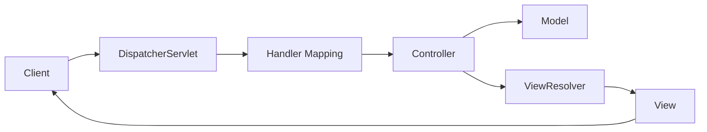

# Understanding Spring MVC: A Comprehensive Guide

Spring MVC is a powerful web framework built on the Model-View-Controller (MVC) pattern, providing a clean separation of concerns and robust features for building web applications. In this guide, we'll explore its architecture, key components, and best practices.

## What is Spring MVC?

Spring MVC is a web framework that implements the Model-View-Controller design pattern. It's part of the Spring Framework and provides a clean way to handle HTTP requests and responses.

```java
@Controller
public class HelloController {
    @GetMapping("/hello")
    public String hello(Model model) {
        model.addAttribute("message", "Welcome to Spring MVC!");
        return "hello";
    }
}
```

## Core Components

### The DispatcherServlet

The DispatcherServlet is the front controller in Spring MVC, handling all incoming HTTP requests. Here's how to configure it:

```java
@Configuration
@EnableWebMvc
public class WebConfig implements WebMvcConfigurer {
    @Override
    public void configureViewResolvers(ViewResolverRegistry registry) {
        registry.jsp("/WEB-INF/views/", ".jsp");
    }
}
```

### Controllers

Controllers handle user requests and return appropriate responses. They're annotated with `@Controller`:

```java
@Controller
@RequestMapping("/users")
public class UserController {
    private final UserService userService;

    @Autowired
    public UserController(UserService userService) {
        this.userService = userService;
    }

    @GetMapping("/{id}")
    public String getUser(@PathVariable Long id, Model model) {
        User user = userService.findById(id);
        model.addAttribute("user", user);
        return "user/details";
    }

    @PostMapping
    public String createUser(@Valid @ModelAttribute User user,
                           BindingResult result) {
        if (result.hasErrors()) {
            return "user/form";
        }
        userService.save(user);
        return "redirect:/users";
    }
}
```

### Models

Models carry data between controllers and views:

```java
public class User {
    private Long id;
    private String username;
    private String email;

    @NotBlank(message = "Username is required")
    public String getUsername() {
        return username;
    }

    @Email(message = "Please provide a valid email")
    public String getEmail() {
        return email;
    }

    // Getters, setters, and other properties
}
```

### Views

Views render the model data. Spring MVC supports various view technologies. Here's a Thymeleaf example:

```html
<!DOCTYPE html>
<html xmlns:th="http://www.thymeleaf.org">
<head>
    <title>User Details</title>
</head>
<body>
    <h1 th:text="${user.username}">Username</h1>
    <p th:text="${user.email}">Email</p>
</body>
</html>
```

## Request Processing Flow

1. Client sends request
2. DispatcherServlet receives request
3. Handler mapping finds appropriate controller
4. Controller processes request and returns model and view
5. ViewResolver resolves view template
6. View renders response



## Advanced Features

### Form Handling

```java
@Controller
public class RegistrationController {
    @GetMapping("/register")
    public String showForm(Model model) {
        model.addAttribute("user", new User());
        return "registration";
    }

    @PostMapping("/register")
    public String processForm(@Valid User user,
                            BindingResult result) {
        if (result.hasErrors()) {
            return "registration";
        }
        // Process the registration
        return "redirect:/welcome";
    }
}
```

### Exception Handling

```java
@ControllerAdvice
public class GlobalExceptionHandler {
    @ExceptionHandler(UserNotFoundException.class)
    public ModelAndView handleUserNotFound(UserNotFoundException ex) {
        ModelAndView mav = new ModelAndView("error/404");
        mav.addObject("message", ex.getMessage());
        return mav;
    }

    @ExceptionHandler(Exception.class)
    public ModelAndView handleGlobalException(Exception ex) {
        ModelAndView mav = new ModelAndView("error/500");
        mav.addObject("message", "An unexpected error occurred");
        return mav;
    }
}
```

### Interceptors

```java
@Component
public class LoggingInterceptor implements HandlerInterceptor {
    private static final Logger logger =
        LoggerFactory.getLogger(LoggingInterceptor.class);

    @Override
    public boolean preHandle(HttpServletRequest request,
                           HttpServletResponse response,
                           Object handler) {
        logger.info("Request URL: {}", request.getRequestURL());
        return true;
    }
}
```

## Best Practices

1. **Use @RestController for REST APIs**
```java
@RestController
@RequestMapping("/api/users")
public class UserRestController {
    @GetMapping("/{id}")
    public ResponseEntity<User> getUser(@PathVariable Long id) {
        return ResponseEntity.ok(userService.findById(id));
    }
}
   ```

2. **Implement Proper Validation**
```java
@PostMapping
public ResponseEntity<User> createUser(
    @Valid @RequestBody UserDTO userDTO) {
    User user = userService.createUser(userDTO);
    return ResponseEntity
        .created(URI.create("/api/users/" + user.getId()))
        .body(user);
}
   ```

3. **Use Constructor Injection**
```java
@Controller
public class ProductController {
    private final ProductService productService;

    public ProductController(ProductService productService) {
        this.productService = productService;
    }
}
   ```

## Testing

```java
@WebMvcTest(UserController.class)
class UserControllerTest {
    @Autowired
    private MockMvc mockMvc;

    @MockBean
    private UserService userService;

    @Test
    void shouldReturnUser() throws Exception {
        given(userService.findById(1L))
            .willReturn(new User(1L, "john", "john@example.com"));

        mockMvc.perform(get("/users/1"))
            .andExpect(status().isOk())
            .andExpect(view().name("user/details"))
            .andExpect(model().attributeExists("user"));
    }
}
```

## Conclusion

Spring MVC provides a robust foundation for building web applications in Java. Its clean architecture, powerful features, and extensive ecosystem make it an excellent choice for modern web development. By following the patterns and practices outlined in this guide, you can build maintainable and scalable web applications.

## Further Reading

- [Official Spring MVC Documentation](https://docs.spring.io/spring-framework/reference/web/webmvc.html)
- [Building REST Services with Spring](https://spring.io/guides/tutorials/rest/)

